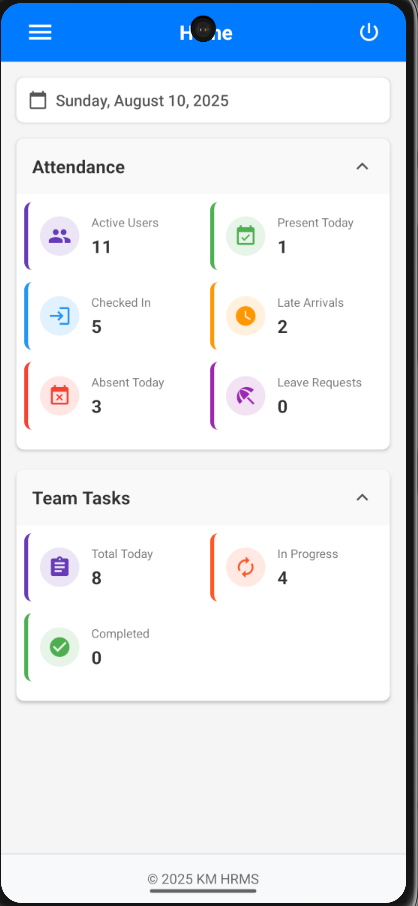
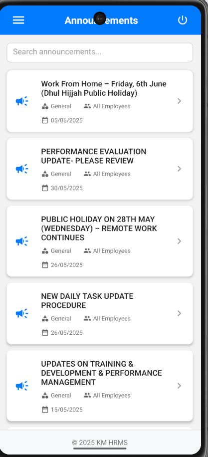
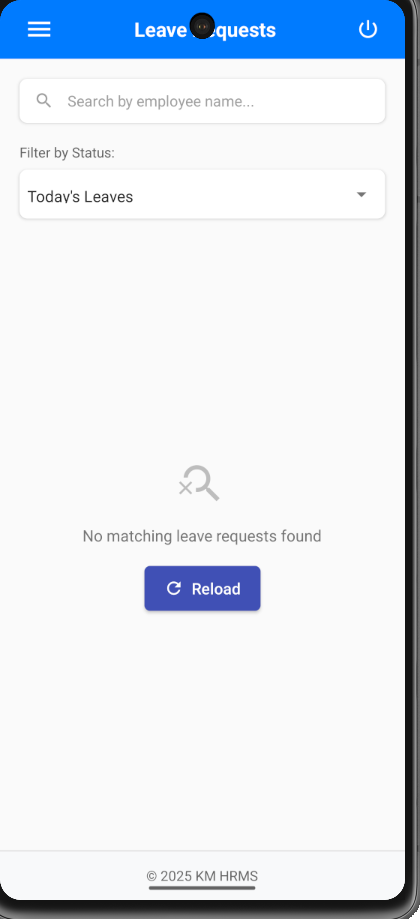
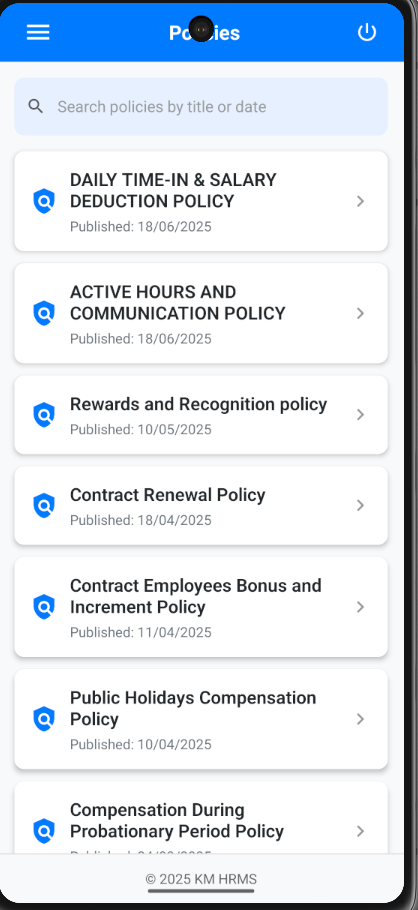

# HRMS Mobile Application  
  

A modern **React Native** HRMS app for employees to manage attendance, leaves, tasks, and HR communications with offline support.

---

## 🌟 Key Features  

### Employee Management
- 👤 View employee profiles with details  
- 🔐 Role-based access control (Admin/Employee)  

### Attendance & Scheduling
- ✅ Daily/monthly attendance tracking  
- 📅 Roster and shift management  
- 🔍 Filter attendance by date/department  

### Leave Management
- 🏖️ Submit/approve leave requests  
- 📊 View leave balances and history  
- 🔔 Approval notifications  

### Task & Training
- 📝 Assign/update team tasks  
- 🎓 Training materials access  

### HR Communications
- 📜 Company policy documents  
- 📢 Real-time announcements  

### Technical
- 📱 Responsive mobile-first design  
- 🔄 Offline support with sync  
- 🔒 Secure authentication  

---

## 📸 Screenshots  

| Dashboard | Announcements | Leave Requests | Policies |
|-----------|------------|----------------|----------|
|  |  |  |  |

---

## 🚀 Getting Started  

### Prerequisites  
- Node.js v16+  
- npm/yarn  
- React Native CLI  
- Android Studio (for Android)  
- Xcode (for iOS)  

### Installation  
1. Clone the repository:  
   ```bash  
   git clone https://github.com/Attesh/km-hrms-app.git  
   cd km-hrms-app  